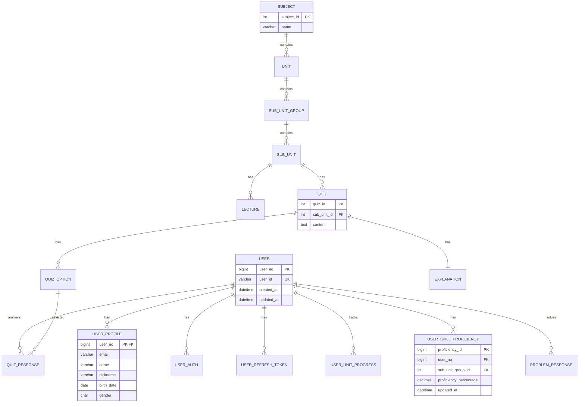

# 🎓 MEP (Metaverse Education Platform)

[](backend/)
[](frontend/)
[](sakt/)
[](flyway/sql/)
[](docker-compose.yml)

## 📖 프로젝트 개요

MEP(Metaverse Education Platform)는 메타버스 환경에서 **개인화된 교육 경험**을 제공하는 통합 플랫폼입니다.

### 🎯 핵심 특징

- **🎮 3D 가상 환경**: Unity 기반 몰입형 학습 공간
- **🤖 AI 기반 개인화**: SAKT (Self-Attentive Knowledge Tracing) 모델을 활용한 학습자 숙련도 추적
- **📊 실시간 학습 분석**: 개인별 학습 진도 및 성취도 분석
- **🔄 적응형 콘텐츠**: 학습자 수준에 맞는 맞춤형 문제 제공
- **👥 협업 학습**: Photon 기반 실시간 멀티플레이어 환경
- **📱 크로스 플랫폼**: WebGL 기반 브라우저 접근성

### 🛠️ 기술 스택

| 분야 | 기술 |
|------|------|
| **Frontend** | Unity 2022.3 LTS, C#, WebGL, Photon PUN2 |
| **Backend** | Spring Boot 3.5.0, Java 17, Spring Security, JPA |
| **AI/ML** | Python Flask, PyTorch, SAKT Algorithm |
| **Database** | MySQL 8.0, Flyway Migration |
| **Infrastructure** | Docker, Nginx, Let's Encrypt SSL |
| **CI/CD** | GitHub Actions, AWS ECS, Terraform |


### 📦 서비스 구성

| 서비스 | 포트 | 역할 | 기술 스택 |
|--------|------|------|----------|
| **nginx** | 80, 443 | 리버스 프록시, SSL 터미네이션 | Nginx, Let's Encrypt |
| **backend** | 8080 | RESTful API, 비즈니스 로직 | Spring Boot, MySQL |
| **sakt** | 5001 | AI 숙련도 예측 | Flask, PyTorch |
| **db** | 3306 | 데이터 저장소 | MySQL 8.0 |

### 🔄 데이터 플로우

1. **사용자 인증**: JWT 기반 토큰 인증
2. **학습 진행**: 실시간 진도 추적 및 저장
3. **퀴즈 응답**: 정답/오답 분석 및 기록
4. **AI 분석**: SAKT 모델을 통한 숙련도 예측
5. **개인화**: 분석 결과 기반 맞춤 콘텐츠 제공

## 🗄️ 데이터베이스 스키마

### 📊 주요 엔티티 관계



### 🔑 핵심 테이블

| 테이블 | 역할 | 주요 컬럼 |
|--------|------|----------|
| `user` | 사용자 기본 정보 | user_no, user_id, created_at |
| `user_profile` | 사용자 프로필 | name, nickname, birth_date, gender |
| `quiz` | 퀴즈 문제 | quiz_id, sub_unit_id, content |
| `quiz_response` | 퀴즈 응답 기록 | user_no, quiz_id, is_correct, answered_at |
| `user_skill_proficiency` | AI 기반 숙련도 | user_no, proficiency_percentage |
| `user_unit_progress` | 학습 진도 | user_no, progress_percentage |

## 🚀 API 문서

### 📡 Backend API (Spring Boot)

**Base URL**: `https://${DOMAIN_NAME}/api`  
**Swagger UI**: `https://${DOMAIN_NAME}/swagger-ui.html`

#### 🔐 인증 API
```bash
POST /api/auth/register     # 사용자 회원가입
POST /api/auth/login        # 사용자 로그인
POST /api/auth/refresh      # 토큰 갱신
POST /api/auth/logout       # 로그아웃
```

#### 👤 사용자 API
```bash
GET    /api/user/profile    # 사용자 프로필 조회
PUT    /api/user/profile    # 사용자 프로필 수정
GET    /api/user/progress   # 학습 진도 조회
```

#### 📚 학습 콘텐츠 API
```bash
GET    /api/quiz/{subUnitId}     # 소단원별 퀴즈 조회
POST   /api/quiz/response        # 퀴즈 응답 제출
GET    /api/progress/{userId}    # 사용자 진도 조회
PUT    /api/progress/update      # 진도 업데이트
```

#### 🎯 개인화 API
```bash
GET    /api/proficiency/{userId}      # 숙련도 조회
POST   /api/custom-problem/generate   # 맞춤형 문제 생성
```

### 🤖 SAKT AI API (Flask)

**Base URL**: `http://localhost:5001`

#### 🧠 머신러닝 API
```bash
POST /sakt/train              # SAKT 모델 학습
POST /sakt/predict            # 숙련도 예측
```

**예측 요청 예시**:
```json
{
  "problemHistory": [
    {
      "problemId": "math_001",
      "isCorrect": true
    },
    {
      "problemId": "math_002", 
      "isCorrect": false
    }
  ]
}
```

**예측 응답 예시**:
```json
{
  "newProficiencyPercentage": 75.32
}
```

## ⚙️ 개발 환경 설정

### 📋 사전 요구사항

- **Docker** 20.10+
- **Docker Compose** 2.0+
- **Git** 2.30+
- **Unity 2022.3 LTS** (프론트엔드 개발 시)
- **Java 17** (백엔드 개발 시)
- **Python 3.8+** (AI 모델 개발 시)

### 🚀 빠른 시작

1. **저장소 클론**
   ```bash
   git clone https://github.com/psp0/Metaverse_Edu_Platform.git
   cd Metaverse_Edu_Platform
   ```

2. **환경 변수 설정**
   ```bash
   cp .env.example .env
   ```
   
   `.env` 파일에서 다음 항목들을 설정하세요:
   ```bash
   # 환경 설정 (local: HTTP, development-https: HTTPS, production: HTTPS)
   ENVIRONMENT=local
   DOMAIN_NAME=localhost               # 실제 도메인명으로 변경
   
   # MySQL Database Configuration
   MYSQL_DATABASE=mepdb
   MYSQL_USER=mepuser
   MYSQL_PASSWORD=your_password_here
   MYSQL_ROOT_PASSWORD=your_root_password_here
   
   # Spring Boot Database Configuration
   SPRING_DATASOURCE_URL=jdbc:mysql://db:3306/mepdb?useSSL=false&allowPublicKeyRetrieval=true&serverTimezone=Asia/Seoul&characterEncoding=UTF-8&connectionCollation=utf8mb4_unicode_ci
   SPRING_DATASOURCE_USERNAME=mepuser
   SPRING_DATASOURCE_PASSWORD=your_password_here
   
   # JWT Configuration
   JWT_SECRET=your_jwt_secret_key_here  # openssl rand -base64 32로 생성
   JWT_ACCESS_TOKEN_VALIDITY_SECONDS=3600
   JWT_REFRESH_TOKEN_VALIDITY_SECONDS=604800
   
   # Backend Server Configuration for Frontend
   BACK_SERVER_URL=http://localhost:8080
   BACK_SERVER_PORT=8080
   
   # SAKT Server Configuration
   FLASK_ENV=production
   SAKT_SERVER_URL=http://localhost:5001
   
   # AI Problem Generation Server
   AI_PROBLEM_SERVER_URL=http://localhost:5002
   ```

3. **SSL 인증서 설정 (환경별 가이드)**
   
   프로젝트는 3가지 환경을 지원하며, 각각 다른 SSL 설정이 필요합니다:

   | 환경 | SSL 설정 | 용도 |
   |------|----------|------|
   | `local` | SSL 없음 (HTTP만) | 로컬 개발 |
   | `development-https` | 자체 서명 인증서 자동 생성 | HTTPS 테스트 |
   | `production` | Let's Encrypt 실제 인증서 | 실제 서비스 |

   **🔧 로컬 개발 (기본)**:
   ```bash
   # .env 파일 설정
   ENVIRONMENT=local
   DOMAIN_NAME=localhost
   
   # HTTP로만 접속: http://localhost
   ```

   **🧪 HTTPS 개발 테스트**:
   ```bash
   # .env 파일 설정
   ENVIRONMENT=development-https
   DOMAIN_NAME=localhost
   
   # 컨테이너 시작 시 자체 서명 인증서 자동 생성됨
   # 브라우저에서 보안 경고 무시하고 진행
   # 접속: https://localhost (인증서 경고 표시됨)
   ```

   **🚀 프로덕션 배포**:
   ```bash
   # .env 파일 설정
   ENVIRONMENT=production
   DOMAIN_NAME=yourdomain.com
   
   # 사전에 Let's Encrypt 인증서가 호스트에 설치되어야 함
   # docker-compose.yml에서 /etc/letsencrypt가 마운트됨
   # 
   # 필요한 인증서 파일:
   # - /etc/letsencrypt/live/yourdomain.com/fullchain.pem
   # - /etc/letsencrypt/live/yourdomain.com/privkey.pem  
   # - /etc/letsencrypt/live/yourdomain.com/chain.pem
   ```

   > **💡 참고**: `development-https` 모드에서는 nginx 컨테이너가 시작할 때 `/nginx/start-nginx.sh` 스크립트가 자동으로 자체 서명 인증서를 생성합니다.


4. **Photon 설정 (Unity 프론트엔드)**
   ```bash
   # Photon 설정 파일 복사
   cp frontend/Assets/Photon/PhotonUnityNetworking/Resources/PhotonServerSettings.asset.template \
      frontend/Assets/Photon/PhotonUnityNetworking/Resources/PhotonServerSettings.asset
   
   # PhotonServerSettings.asset 파일에서 YOUR_PHOTON_APP_ID_HERE를 
   # 실제 Photon App ID로 교체 (https://dashboard.photonengine.com에서 발급)
   ```

5. **애플리케이션 실행**
   ```bash
   # 전체 스택 실행
   docker-compose up --build -d
   
   # 로그 확인
   docker-compose logs -f
   ```

6. **접속 확인**
   - **Backend API**: `http://localhost:8080/api/health`
   - **Swagger UI**: `http://localhost:8080/swagger-ui.html`
   - **SAKT AI Service**: `http://localhost:5001/sakt/predict`
   - **Frontend**: Unity WebGL 빌드 후 브라우저에서 접근

### 🛠️ 개발 모드 실행

#### Backend 개발
```bash
cd backend
./gradlew bootRun
```

#### AI 서비스 개발
```bash
cd sakt
pip install -r requirements.txt
python sakt_server.py
```

#### Frontend 개발
1. Unity Hub에서 프로젝트 열기
2. `frontend/` 폴더를 Unity에서 열기
3. WebGL 플랫폼으로 빌드
4. 빌드 결과물을 웹 서버에서 실행

4. 빌드 결과물을 웹 서버에서 실행

### 🔧 서비스별 포트

| 서비스 | 포트 | 접속 URL |
|--------|------|----------|
| Nginx | 80, 443 | `http://localhost` |
| Backend | 8080 | `http://localhost:8080` |
| SAKT AI | 5001 | `http://localhost:5001` |
| MySQL | 3306 | 내부 네트워크만 접근 |

### 📚 주요 디렉토리 구조

```
Metaverse_Edu_Platform/
├── backend/                 # Spring Boot 백엔드
│   ├── src/main/java/      # Java 소스 코드
│   ├── build.gradle        # Gradle 빌드 설정
│   └── Dockerfile          # 백엔드 컨테이너 설정
├── frontend/               # Unity 프론트엔드
│   ├── Assets/Script/      # C# 스크립트
│   └── Build/WebGL/        # WebGL 빌드 결과물
├── sakt/                   # SAKT AI 서비스
│   ├── sakt_server.py      # Flask 서버
│   ├── requirements.txt    # Python 의존성
│   └── models/            # 학습된 AI 모델
├── flyway/sql/            # 데이터베이스 마이그레이션
├── nginx/                 # 리버스 프록시 설정
└── docker-compose.yml     # 서비스 오케스트레이션
```

## 🚀 배포 및 CI/CD

### 🔄 자동화된 파이프라인

이 프로젝트는 **GitHub Actions**를 통한 완전 자동화된 CI/CD 파이프라인을 제공합니다.

#### ✨ 주요 기능
- ✅ **PR별 독립 테스트 환경**: Pull Request 생성 시 자동으로 독립적인 테스트 환경 배포
- ✅ **자동 정리**: 테스트 환경은 30분 후 또는 PR 종료 시 자동 삭제
- ✅ **프로덕션 자동 배포**: main 브랜치 병합 시 프로덕션 환경 자동 배포
- ✅ **실시간 알림**: 각 단계별 진행상황을 PR 댓글로 실시간 알림

#### 🏷️ 리소스 네이밍 규칙
- **프로덕션**: `mep-*` (예: mep-cluster, mep-backend-service)
- **테스트 환경**: `mep-pr-{번호}-*` (예: mep-pr-123-cluster)
- **도메인**: `pr-{번호}-{원본도메인}` (예: pr-123-api.yourdomain.com)

### 🔐 필수 환경 변수 (GitHub Secrets)

#### Unity 빌드
- `UNITY_LICENSE`: Unity 라이선스
- `UNITY_EMAIL`: Unity 계정 이메일  
- `UNITY_PASSWORD`: Unity 계정 비밀번호

#### AWS 인프라
- `AWS_ACCESS_KEY_ID`: AWS 액세스 키
- `AWS_SECRET_ACCESS_KEY`: AWS 시크릿 키
- `AWS_REGION`: AWS 리전 (예: ap-northeast-2)

#### 도메인 및 보안
- `FRONTEND_DOMAIN_NAME`: 프론트엔드 도메인
- `BACKEND_DOMAIN_NAME`: 백엔드 도메인  
- `ACM_CERTIFICATE_ARN`: SSL 인증서 ARN
- `JWT_SECRET`: JWT 시크릿 키

#### 데이터베이스
- `DB_ADMIN_USERNAME`: DB 관리자 사용자명
- `DB_ADMIN_PASSWORD`: DB 관리자 비밀번호

## 🤖 SAKT AI 모델

### 📊 Self-Attentive Knowledge Tracing

MEP의 핵심 AI 엔진인 **SAKT (Self-Attentive Knowledge Tracing)** 모델은 학습자의 과거 학습 이력을 분석하여 현재 숙련도를 예측합니다.

#### 🧠 모델 특징
- **Transformer 기반**: Multi-head Attention 메커니즘 활용
- **시퀀스 학습**: 문제 풀이 순서와 정답 여부를 종합 분석
- **실시간 예측**: 새로운 문제 풀이 후 즉시 숙련도 업데이트
- **개인화**: 개별 학습자의 학습 패턴 반영

#### 📈 성능 지표
- **AUC**: 모델 정확도 측정
- **Loss**: 예측 오차 최소화
- **실시간 처리**: 평균 응답 시간 < 200ms

## 🔗 관련 링크

- 📖 **[프로젝트 위키](https://github.com/psp0/Metaverse_Edu_Platform/wiki)**: 상세 문서
- 🚀 **[릴리즈 노트](https://github.com/psp0/Metaverse_Edu_Platform/releases)**: 버전별 변경사항
- 📊 **[프로젝트 보드](https://github.com/psp0/Metaverse_Edu_Platform/projects)**: 개발 진행상황


## 📄 라이선스

이 프로젝트는 MIT 라이선스 하에 배포됩니다. 자세한 내용은 `LICENSE` 파일을 참조하세요.

## 👥 팀

- **Frontend**: Unity 3D 개발
- **Backend**: Spring Boot API 개발, SAKT 모델 개발
- **DevOps**: 인프라 및 배포 자동화

---

<div align="center">

**🎓 MEP - 미래의 교육을 메타버스에서 경험하세요! 🚀**

Made with ❤️ by MEP Team

</div>